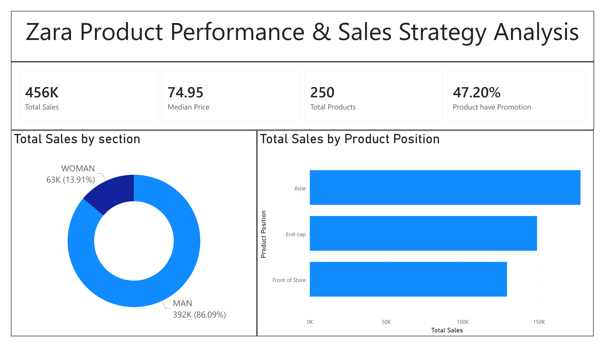
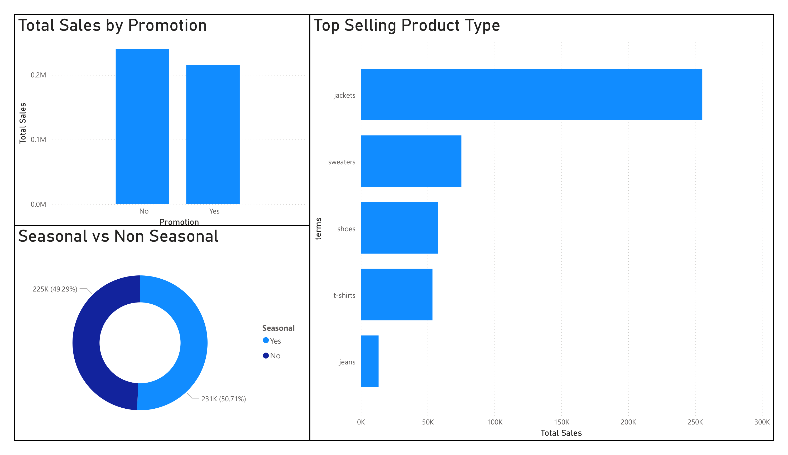
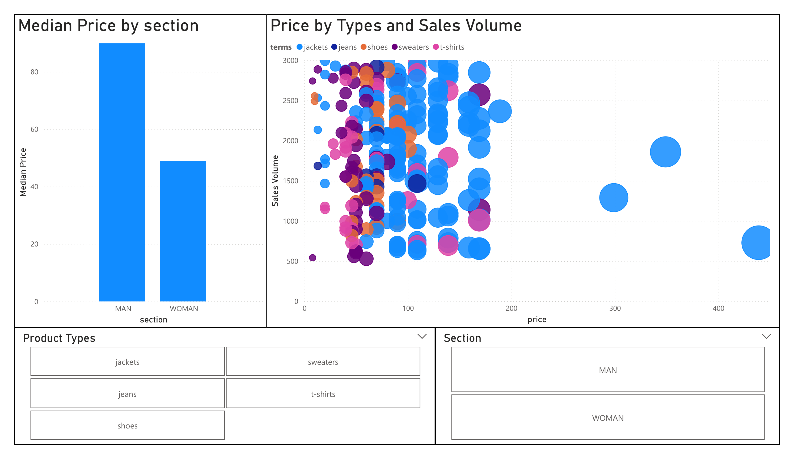

# Zara Product Performance & Sales Strategy Analysis

## Project Overview

This project analyzes **Zara product performance and sales strategy** using multiple data analytics tools.
The goal is to understand how **product placement, promotions, pricing, and product categories affect sales performance**.

The analysis includes interactive dashboards and exploratory analysis using **Power BI, Python, SQL, and Google Sheets**.

---

## Tools & Technologies

* Power BI
* Python (Pandas, Matplotlib, Seaborn)
* SQL
* Google Sheets

---

## Dataset

The dataset contains information about Zara products including:

* Product ID
* Product Position
* Promotion
* Product Category
* Seasonal Indicator
* Sales Volume
* Price
* Product Type
* Section (Men / Women)

---

## Key Business Questions

* Which product categories generate the highest sales?
* How does **product placement** affect sales performance?
* Do **promotions significantly increase sales**?
* What price range generates the highest sales volume?
* How do **seasonal products perform compared to non-seasonal products**?

---

## Dashboard Preview

### Sales Overview

### Product Strategy Analysis

### Pricing & Sales Relationship

---
### Key Insights  

**1. Sales Distribution**  
The **Men’s section generates the majority of total sales**, indicating stronger demand for men's fashion products compared to women's products.

**2. Product Placement Impact**  
Products placed in **store aisles generate higher total sales than front-of-store and end-cap placements**, suggesting browsing areas drive more consistent purchases.

**3. Promotion Effectiveness**  
Products with **promotions show higher overall sales performance**, highlighting the importance of discounts in increasing customer purchases.

**4. Top Selling Products**  
**Jackets are the highest selling product category**, followed by sweaters and shoes, indicating strong demand for outerwear products.

**5. Price Sensitivity**  
Most products with **mid-range prices generate higher sales volume**, suggesting customers prefer moderately priced items.

---

## Author

Nikhil Patel  
Aspiring Data Analyst
